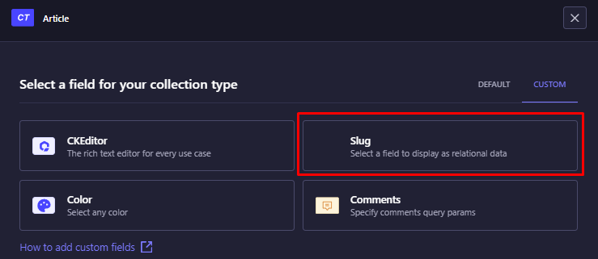

# Strapi plugin::ab-custom-slug
---

Slug/UID is generated based on the tagrget field that is selected on the field creation screen.


## Installation
Install the plugin in your Strapi project.

- npm i ab-custom-slug | [npm](https://www.npmjs.com/package/ab-custom-slug)
- npm run build  
- npm run develop


```
Once installed go to content-type-builder 
and add a field to any collection type.
In the Custom fields section you will find the Slug field.
```


